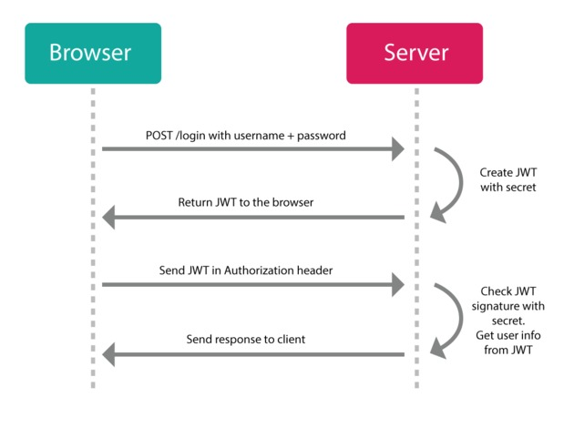

<h3 style="text-align: center; padding-bottom: 14px">2024-02-02</h3>

# Lesson plan No. 13 08/19/2024

## What we learned and did in the last lesson:
Spring Security is ...

- Authentication
- Authorization

We implemented **Spring Security** into the project:
- User
- Role
- changelog v.0.4.0
- password encryptor
- fill in the User, Role tables
- UserDetails
- Repository
- UserRepository
- RoleRepository
- UserService
- ProductController
- getAll
- getById
- security/config
- SecurityConfig
- testing in Postman

## Topic of today's lesson:
- Using JWT (Json Web Token)
  

## Practice
- we study the necessary amount of actions and code for implementation:
- adding dependencies to pom.xml
- sec_dto
- RefreshRequestsDto
- TokenResponseDto
- class AuthInfo
- security_service - TokenService - AuthService - security_controller - AuthController - /auth - /auth/login - /auth/refresh - security_config - SecurityConfig - part 1 - sec_filter - TokenFilter - security_config - SecurityConfig - part 2 - testing

___

# План занятия №13 19.08.2024

## Что мы узнали и сделали за прошлое занятие:
Spring Security - это ... 
  - Authentication
  - Authorization

Выполнили внедрение **Spring Security** в проект:
- User 
- Role
- changelog v.0.4.0
- шифровальщик паролей 
- заполняем таблицы User, Role
- UserDetails
- Repository
  - UserRepository
  - RoleRepository
- UserService
- ProductController
  - getAll
  - getById
- security/config
  - SecurityConfig
- тестирование в Postman

## Тема сегодняшнего занятия:
- Использование JWT (Json Web Token)

## Практика
- изучаем необходимый объем действий и кода для реализации:
  - добавление зависимостей в pom.xml
  - sec_dto
    - RefreshRequestsDto
    - TokenResponseDto
  - class AuthInfo
  - security_service
    - TokenService
    - AuthService 
  - security_controller
    - AuthController
      - /auth
      - /auth/login
      - /auth/refresh
  - security_config
    - SecurityConfig - part 1
  - sec_filter
    - TokenFilter
  - security_config
    - SecurityConfig - part 2

- проводим тестирование 
